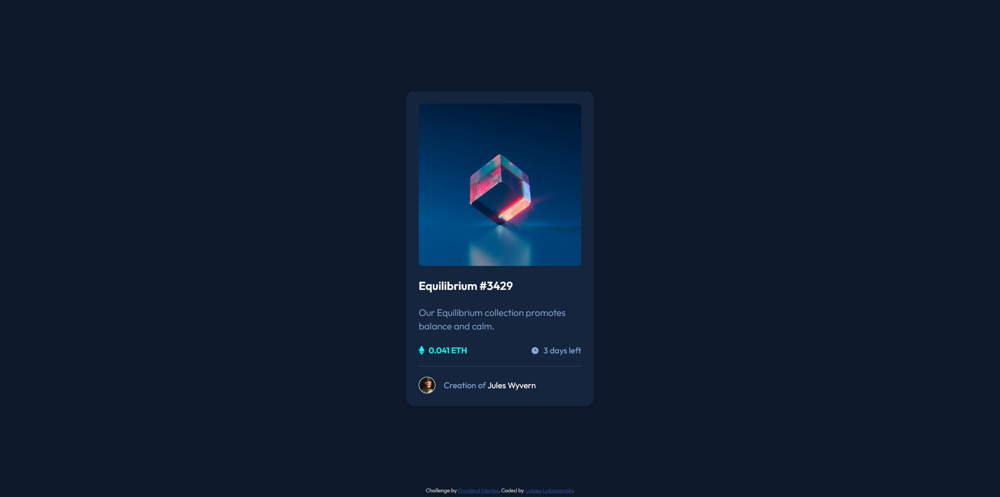

# Frontend Mentor - NFT preview card component solution

This is a solution to the [NFT preview card component challenge on Frontend Mentor](https://www.frontendmentor.io/challenges/nft-preview-card-component-SbdUL_w0U). Frontend Mentor challenges help you improve your coding skills by building realistic projects. 

## Table of contents

- [Frontend Mentor - NFT preview card component solution](#frontend-mentor---nft-preview-card-component-solution)
  - [Table of contents](#table-of-contents)
  - [Overview](#overview)
    - [The challenge](#the-challenge)
    - [Screenshot](#screenshot)
    - [Links](#links)
  - [My process](#my-process)
    - [Built with](#built-with)
    - [What I learned](#what-i-learned)
  - [Author](#author)
  - [Acknowledgments](#acknowledgments)

## Overview

### The challenge

Users should be able to:

- View the optimal layout depending on their device's screen size
- See hover states for interactive elements

### Screenshot



### Links

- Solution URL: [Add solution URL here](https://your-solution-url.com)
- Live Site URL: [Github Pages](https://luckyszakul0.github.io/FM-NFT-preview-card-component/)

## My process

### Built with

- Semantic HTML5 markup
- SCSS custom properties
- Flexbox
- JS animate method
- Cursor follower
- Desktop-first workflow
- [SCSS](https://sass-lang.com/) - CSS Preprocessor

### What I learned

I've had some/many problems with making the events on image click but in the end, I guess I managed. I also wanted to have a try with mouse follower for the first time as it seemed to me that the vibe od the website suits it.

```js
enlarged.animate([
  {
    transform: 'translateY(-150px)',
    opacity: 0
  },
  {
    transform: 'translateY(0)',
    opacity: 1
  }
], animateParams)
```

## Author

- Github - [Łukasz Lubaszewski](https://github.com/luckyszakul0)
- Frontend Mentor - [@Lukasz710](https://www.frontendmentor.io/profile/Lukasz710)

## Acknowledgments

[Hyperplexed's blob cursor follower](https://codepen.io/Hyperplexed/pen/KKBjvbG) - An awesome cursor follower from Hyperplexed. I VERY HEAVILY inspired mine from his.
